<div align="center">

# 🦀 Sidecrab for Windows

**A desktop pet for Claude Code, ported to Windows.**

A tiny always-on-top pixel crab that lives on your screen and reacts to what
Claude is doing. He sits at his laptop while Claude works, waves you down when a
tool needs permission, wanders off when you step away, and naps when things go
quiet. Under him sits a small status bar with Claude's activity, context usage
and your 5-hour limit.

Windows fork of [zvoque/sidecrab](https://github.com/zvoque/sidecrab) (macOS).

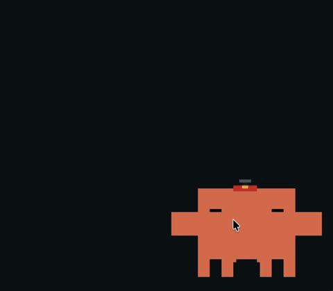

</div>

## What he does

| | | | |
|:---:|:---:|:---:|:---:|
| 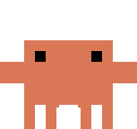 | 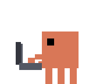 | 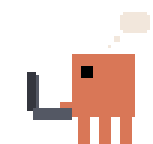 | 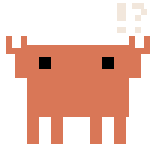 |
| **idle** | **working** | **thinking** | **permission** |
| resting on your desktop | at his laptop, on any tool | pondering something | flagging you down |

...and a handful of other moods and moves he'll show you himself.

## Live on your desktop

<div align="center">
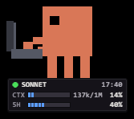
</div>

Captured from the real app at Medium size, no hat: the crab at his laptop and the status bar under him.

## What this fork adds

- **Windows build**: native Win32 idle detection, click-through outside the
  sprite, and a watchdog that keeps him above ordinary windows (the Claude
  desktop app, browsers) without fighting other always-on-top apps.
- **Claude Code plugin mode**: he appears by himself when a Claude Code
  session starts and quits about 15 seconds after the last Claude Code process
  closes. `/pet on`, `/pet off` and `/pet` (status) work from any chat.
- **Status bar**: activity dot, model and tokens, context meter, and the 5-hour
  usage meter with its local reset time. Compact mode shows a small plate that
  expands on hover.
- **Light on the machine**: the sprite is redrawn only when the picture
  changes, so an idle pet uses a few percent of one CPU core.

## Status bar

A small panel under the crab shows what Claude Code is doing right now.

| | | |
|:---:|:---:|:---:|
| 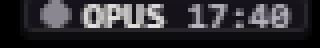 | 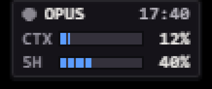 | 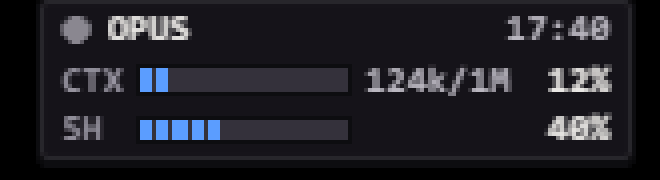 |
| **mini plate**: model and reset time. Grows on hover. | **compact**: context and 5-hour meters | **full**: also the token count |

- **Dot**: green while Claude thinks or runs a tool, yellow when it waits for
  your permission, red on an error or after 10 minutes of silence, grey when idle.
- **CTX**: how full the context window is (1M tokens, 200K for Haiku).
- **5H**: your 5-hour usage limit. `~14:30` marks an estimated reset time,
  and a dimmed value with `?` is not confirmed yet.

Turn the mini plate on or off with **Compact status bar** in the right-click menu.

## Interactions

| Do this | He does |
|---|---|
| **Drag** him anywhere | settles there and stays put |
| **Double-click** | focuses the app running your session |
| **Right-click** | opens settings |

### Right-click menu

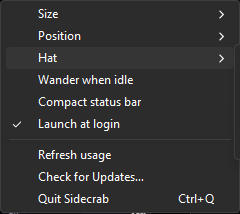

| Item | What it does |
|---|---|
| **Size** | Small, Medium or Large |
| **Position** | snap to a corner, or reset |
| **Hat** | none, top hat, chef's hat, fedora, helicopter hat |
| **Wander when idle** | short strolls when you are away |
| **Compact status bar** | mini plate that expands on hover |
| **Launch at login** | start with Windows |
| **Start with Claude Code** | appear with every Claude Code session (plugin mode, on by default) |
| **Keep Claude login fresh** | when Claude Code's stored login expires, ask Claude Code to renew it so the 5-hour meter stays live (on by default) |
| **Refresh usage** | ask for the 5-hour limit now; the reset time shows `…`, then `fail` if it could not |
| **Check for Updates…** | look for a newer release here |
| **Quit Sidecrab** | close the pet (`Ctrl+Q`) |

## Hats

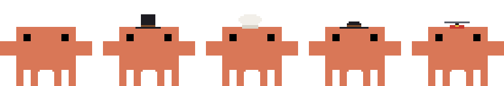

Right-click into **Hat** for a top hat, chef's hat, fedora, or helicopter hat.
Whatever he's wearing rides along through every animation.

## Requirements

- Windows 10 or 11 with the WebView2 runtime (preinstalled on Windows 11).
- [Claude Code](https://claude.com/claude-code): the CLI or the Claude desktop app.
- To build: [Rust](https://rustup.rs) (MSVC toolchain), [Node.js](https://nodejs.org)
  and Git. There are no prebuilt binaries yet.

## Install

```powershell
git clone https://github.com/yshu17/sidecrab-windows.git
cd sidecrab-windows
powershell -ExecutionPolicy Bypass -File .\install-windows.ps1
```

The script builds `sidecrab.exe` and `sidecrab-hook.exe`, copies them to
`%LOCALAPPDATA%\Programs\sidecrab`, and adds that folder to your user `PATH`.

Then pick **one** way to connect him to Claude Code.

### Option A: Claude Code plugin (recommended)

```powershell
claude plugin marketplace add .
claude plugin install sidecrab@local
```

Restart Claude Code. From then on he starts with every session (untick
**Start with Claude Code** in his menu to stop that). In any chat:

| Command | Result |
|---|---|
| `/pet on` | starts the pet, or shows it if it is already running |
| `/pet off` | quits the pet completely, until the next session starts him |
| `/pet` | tells you whether it is running |

`/sidecrab` is an alias of `/pet`.

### Option B: standalone

Run `sidecrab` from any terminal. On first launch he asks before adding a few
hooks to `~/.claude/settings.json`. The file is backed up first, and you can
remove the hooks from the right-click menu at any time.

Don't use both options at once: every event would reach him twice.

## Update

```powershell
sidecrab-update
```

This pulls the latest commits (fast-forward only) and reruns the installer. The
installer also refreshes the plugin when `claude` is on your `PATH`.
**Check for Updates…** in the right-click menu tells you when a newer release is
published here. It never downloads anything.

## Privacy and security

- The hook only writes small JSON files under `%APPDATA%\sidecrab`. It never
  touches the network, and it returns in about 10 ms, so Claude Code never waits
  on it.
- For the 5-hour meter the pet asks Anthropic's usage endpoint with your existing
  Claude Code login from `~/.claude/.credentials.json`, at most every 30 minutes.
  The token goes to `curl` through stdin; it is never logged or written anywhere.
- The update check reads this repository's latest release from the GitHub API.
- The window runs under a strict Content Security Policy and shows text only as
  plain text.

## Development

```bash
cd src-tauri
cargo test --workspace
```

Open `src/index.html` in a browser to work on the animations without Tauri
(keys 1–6 cycle states). [CLAUDE.md](CLAUDE.md) describes the architecture.

## Credits

- Original app: [zvoque/sidecrab](https://github.com/zvoque/sidecrab).
- Windows port this repository was forked from: [whorlyknows/sidecrab-windows](https://github.com/whorlyknows/sidecrab-windows).
- Activity detection design and walk-cycle frames:
  [claude-status-bar](https://github.com/m1ckc3s/claude-status-bar).
  See [ACKNOWLEDGEMENTS.md](ACKNOWLEDGEMENTS.md).
- Built with [Tauri](https://tauri.app). MIT licensed, see [LICENSE](LICENSE).

## Trademark & IP

This is an unofficial, open-source side project, not affiliated with, endorsed
by, or sponsored by Anthropic. "Claude", "Clawd", and the Clawd crab design are
Anthropic's trademarks and intellectual property, referenced here nominatively.
The sprite frames derive from Anthropic's Clawd artwork, by way of
[claude-status-bar](https://github.com/m1ckc3s/claude-status-bar).
